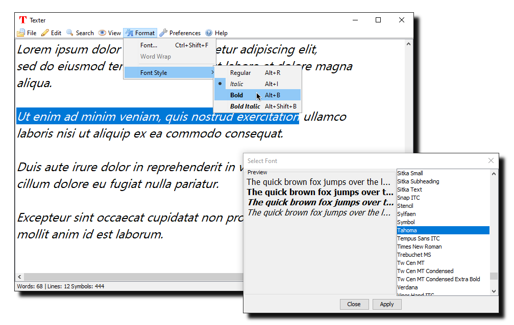

# 

# Texter

Texter is a simple, lightweight text editor. Texter is entirely developed in Kotlin using the **Swing GUI Widget Toolkit**.

> **System Requirements:** Texter requires **Java 8 or later** (JRE/JDK). It is primarily designed and tested on **Windows**, but should work on any OS that supports Java.

### Texter includes a set of features designed to enhance productivity:
- **Undo/Redo** – Easily revert or repeat your changes.
- **Search** – Quickly find keywords in your document.
- **Clipboard Operations** – Full support for cut, copy, and paste.
- **Date/Time Insertion** – Insert the current date and time at the cursor with a single shortcut.
- **Font Customization** – Adjust font type and style to suit your preference.
- **Themes** – Switch between different visual themes to make your text editing experience comfortable and personalized.
- **Various Hotkeys** – Perform common functions quickly and efficiently.

Whether you're taking notes or drafting documents, Texter delivers a clean and distraction-free editing experience.

### Planned Features:
- Syntax Highlighting
- Performance Improvements
- Better Save/Open Implementation
- Word Wrapping
- Better Global Theming (so the entire application adjusts on a specific theme)
- Multi-language Support
- Advanced Settings Menu
- Context Menus

*Note: Texter is currently in beta, so some features may still be under development, unstable, or subject to change. Planned features are subject to change as Texter is in active development.

Texter is licensed under the GNU General Public License v3.0 (GPL-3.0). See the LICENSE file for details.

---

### Credits
Texter uses the [Silk Icon Set 1.3](http://www.famfamfam.com/lab/icons/silk/) by Mark James, licensed under [CC BY 2.5](http://creativecommons.org/licenses/by/2.5/).  
Thank you to Mark James for providing these icons.